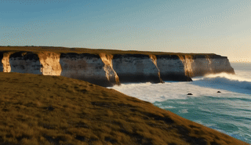
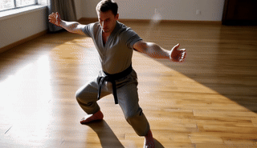
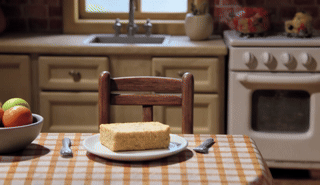
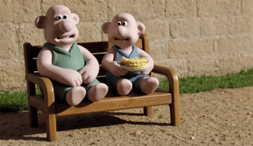
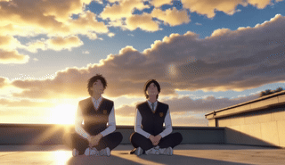
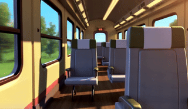
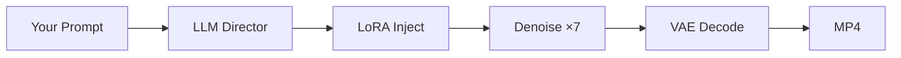

# LTX-Video 13B — Free GPU Pipeline

Run the full 13-billion parameter LTX-Video model on **free Kaggle T4 GPUs**. Text-to-video, image-to-video, 22 swappable LoRA styles, and LLM prompt enhancement — zero cost, no A100 required.

[](https://www.kaggle.com/code/damnyadav/ltxv-13b-distilled-free-gpu-pipeline)
[](https://huggingface.co/Lightricks/LTX-Video-0.9.8-13B-distilled)
[](LICENSE)
[](https://github.com/DamnKuldeep/ltxv-13b-distilled-free-gpu-pipeline/stargazers)

**→** [Open the Notebook](https://www.kaggle.com/code/damnyadav/ltx-13b-distilled) · [Pre-cached Model Dataset](https://www.kaggle.com/datasets/damnyadav/ltxv13b-distilled-cache)

---

## Contents

- [Results](#results)
- [Features](#features)
- [Architecture](#architecture)
- [LoRA Adapters](#lora-adapters)
- [Getting Started](#getting-started)
- [Usage](#usage)
- [Technical Reference](#technical-reference)
- [Limitations](#limitations)

---

## Results

Every clip below was generated on a free Kaggle T4×2 notebook. No paid compute, no cloud credits.

<table>
<tr>
<td width="50%" align="center">
<strong>Snorricam · Character Walk</strong><br>

</td>
<td width="50%" align="center">
<strong>Base T2V · City Timelapse</strong><br>

</td>
</tr>
<tr>
<td align="center">
<strong>Flying · Coastal Cliffs</strong><br>

</td>
<td align="center">
<strong>Bullet Time · Martial Arts</strong><br>

</td>
</tr>
<tr>
<td align="center">
<strong>Arcane Style · Jinx</strong><br>

</td>
<td align="center">
<strong>Character · Jinx Portrait</strong><br>

</td>
</tr>
<tr>
<td align="center">
<strong>Wallace &amp; Gromit · Kitchen</strong><br>

</td>
<td align="center">
<strong>Wallace &amp; Gromit · Garden</strong><br>

</td>
</tr>
<tr>
<td align="center">
<strong>Arcane Style · Rooftop</strong><br>

</td>
<td align="center">
<strong>Base T2V · Train Window</strong><br>

</td>
</tr>
</table>

---

## Features

- **13B model on free GPUs** — NF4 quantization compresses ~40 GB of weights to ~10 GB, fitting entirely on a Tesla T4.
- **22 LoRA adapters** — Camera effects (bullet time, snorricam, 360°, flying), art styles (Arcane, Shinkai, Wallace & Gromit), and visual effects (melt, cakeify, explosion). Hot-swappable between runs.
- **15s native / 30s+ chunked** — Standard generation up to 15 seconds. Autoregressive mode extends to 30+ seconds with 33-frame overlap.
- **AI prompt enhancement** — NVIDIA NIM Llama-3.3-70B rewrites your rough descriptions into detailed cinematic prompts.
- **Gradio UI** — Full web interface. Pick a LoRA, type a prompt, click generate.
- **Dual-GPU memory split** — Transformer + LoRA on GPU 0, text encoder + VAE decode on GPU 1.

---

## Architecture

### Pipeline Flow

```
Prompt → LLM Enhancement (NVIDIA NIM) → LoRA Injection → 7-Step Denoise → VAE Decode → MP4
```



### Memory Layout (Dual T4)

| GPU | Component | VRAM |
|:---|:---|---:|
| `cuda:0` | Transformer (NF4) | ~10.4 GB |
| `cuda:0` | Active LoRA adapter | ~0.8 GB |
| `cuda:0` | VAE encoder buffer | ~0.4 GB |
| `cuda:0` | *Free headroom* | ~3.4 GB |
| `cuda:1` | T5-XXL encoder (NF4) | ~4.5 GB |
| `cuda:1` | VAE decode target | ~8.0 GB |
| `cuda:1` | *Free headroom* | ~2.5 GB |

### LoRA Hot-Swap Cycle

Each adapter follows a strict **load → use → purge** cycle to prevent VRAM leaks:

1. Load `.safetensors` from local disk cache
2. Remap ComfyUI weight keys → Diffusers format
3. Inject PEFT layers into the transformer on `cuda:0`
4. Run inference at adapter weight = 1.0
5. Delete adapter → `gc.collect()` → `torch.cuda.empty_cache()`

Only one adapter is active at a time. Switching LoRAs between runs adds ~5 seconds of overhead.

---

## LoRA Adapters

<details>
<summary><strong>All 22 adapters (click to expand)</strong></summary>

<br>

### Camera Effects

| Name | Trigger Keyword | Mode | What it does |
|:---|:---|:---|:---|
| Bullet Time | `bullet-time` | T2V/I2V | Matrix-style freeze + 360° orbital |
| Through Object | `through-object` | T2V | Camera passes through solid surfaces |
| Snorricam | `snorricam` | T2V/I2V | Body-mounted camera, subject centered |
| 360° Equirect | `360-equirectangular` | T2V | Panoramic equirectangular output |
| Flying | `flying` | T2V | Smooth aerial/drone motion |

### Art Styles

| Name | Trigger Keyword | Mode | What it does |
|:---|:---|:---|:---|
| Wallace & Gromit | `walgro style` | T2V/I2V | Aardman claymation aesthetic |
| Arcane | `csetiarcane` | T2V/I2V | Painterly animation with rim lighting |
| Shinkai Anime | `sh1nka1 style` | T2V/I2V | Makoto Shinkai look (Your Name, Suzume) |
| Fat Elvis | `FATELVIS` | T2V/I2V | Elvis character transformation |

### Visual Effects

| Name | Trigger Keyword | Mode | What it does |
|:---|:---|:---|:---|
| Cakeify | `CAKEIFY` | T2V/I2V | Objects become hyper-realistic cakes |
| Melt | `M3LTYX` | T2V/I2V | Objects melt like wax |
| Face Punch | `Face_punch` | I2V | Impact shockwave on portraits |
| Building Blast | `Building_explosion` | T2V | Building destruction |
| Car Grip | `CarGrip` | T2V | Drifting with tire smoke |
| Amgery | `AMGERY` | I2V | Looney Tunes exaggerated anger |

*Plus 7 additional community adapters included in the notebook.*

</details>

---

## Getting Started

### What You Need

1. **Kaggle account** — [Sign up](https://kaggle.com) and verify your phone number (required for GPU access).
2. **HuggingFace token** — Accept the [LTX-Video model terms](https://huggingface.co/Lightricks/LTX-Video-0.9.8-13B-distilled), then grab your [access token](https://huggingface.co/settings/tokens).
3. **NVIDIA NIM key** — Free API key from [build.nvidia.com](https://build.nvidia.com) for prompt enhancement.

### Add Secrets in Kaggle

Go to **Add-ons → Secrets** in your notebook and add:

| Key | Value |
|:---|:---|
| `HF_TOKEN` | Your HuggingFace access token |
| `NIM_API_KEY` | Your NVIDIA NIM API key |

### Skip the Download (Optional)

The first run downloads ~10 GB of model weights. To cut startup to ~2 minutes:

1. Click **+ Add Data** in your Kaggle notebook
2. Search for `ltxv13b-distilled-cache` by `damnyadav`
3. Add it — the notebook automatically detects and uses the cache

### Launch

Set the notebook accelerator to **GPU T4 ×2**, then **Run All**. The Gradio UI will appear with a public link.

---

## Usage

1. **Pick a LoRA** — Select from the dropdown, or leave as "None" for the base model.
2. **Write a prompt** — Describe your scene naturally. Doesn't need to be perfect.
3. **Enhance** — Click "Enhance Prompt". The LLM rewrites it into a detailed cinematic description.
4. **Generate** — Click "Generate Video". Takes roughly 4–6 minutes for a 10-second clip.

> **Tip:** Stick to **480p** when using LoRAs for stable VRAM. 720p is fine without adapters.

---

## Technical Reference

<details>
<summary><strong>Pipeline constants and internals</strong></summary>

<br>

| Parameter | Value | Purpose |
|:---|:---|:---|
| `MAX_TOKENS` | 128 | T5-XXL tokenizer ceiling |
| `STEPS` | 7 | Distilled non-uniform denoising schedule |
| `CFG_SCALE` | 1.0 | Guidance-free (distilled model requirement) |
| `CHUNK_FFN` | 512 | Feed-forward chunking — reduces activation peak by ~8× |
| `TAIL_OVERLAP` | 33 frames | Autoregressive context window for chunked generation |

The denoising loop uses a non-uniform 7-step schedule optimized for the distilled checkpoint. CFG is pinned at 1.0 because the model was distilled with guidance baked in — raising it produces artifacts, not more detail.

</details>

---

## Limitations

- **Quantization trade-off** — NF4 compression loses some fine-grain detail compared to full FP16 on an A100. Most noticeable in faces and small text.
- **Prompt length** — The T5 encoder ignores tokens past ~65 words. Keep your prompts focused.
- **One LoRA at a time** — Each adapter uses ~805 MB of VRAM. Loading two simultaneously will OOM on a T4.
- **Generation time** — Expect 4–6 minutes per 10-second clip. Chunked generation (30s+) scales linearly.

---

<div align="center">

Built by [DamnKuldeep](https://github.com/DamnKuldeep) · [Apache 2.0](LICENSE)

</div>
