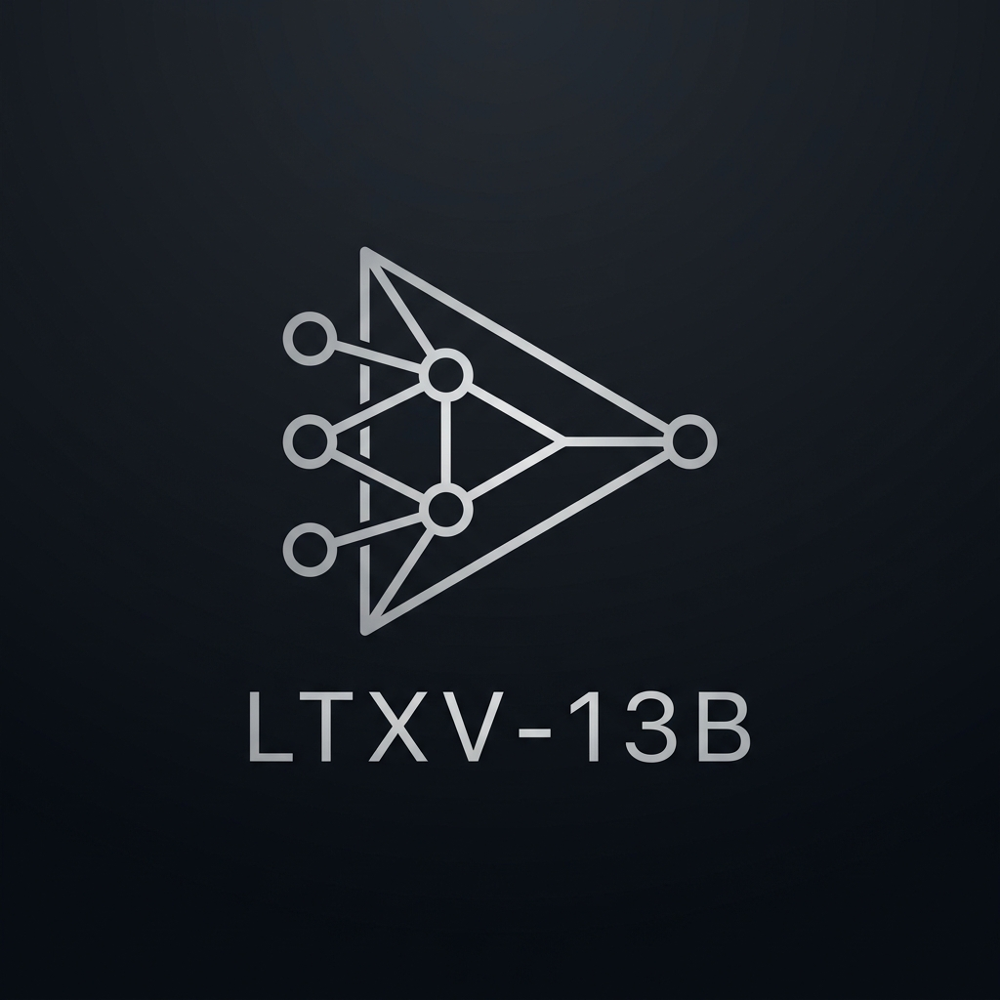
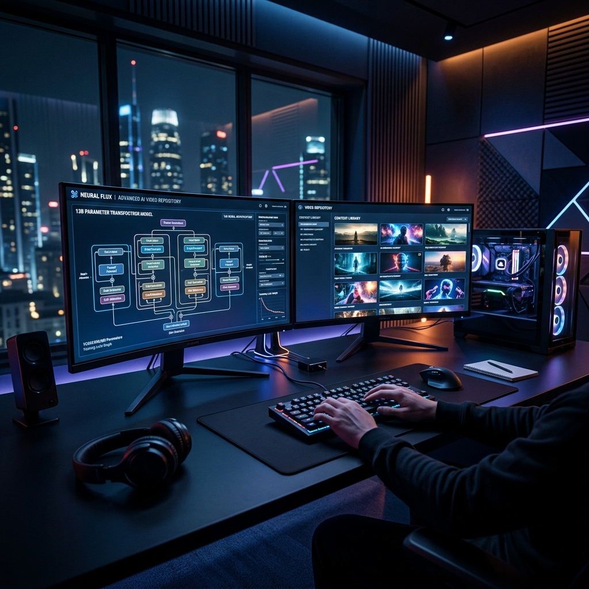
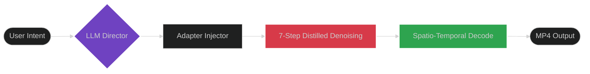
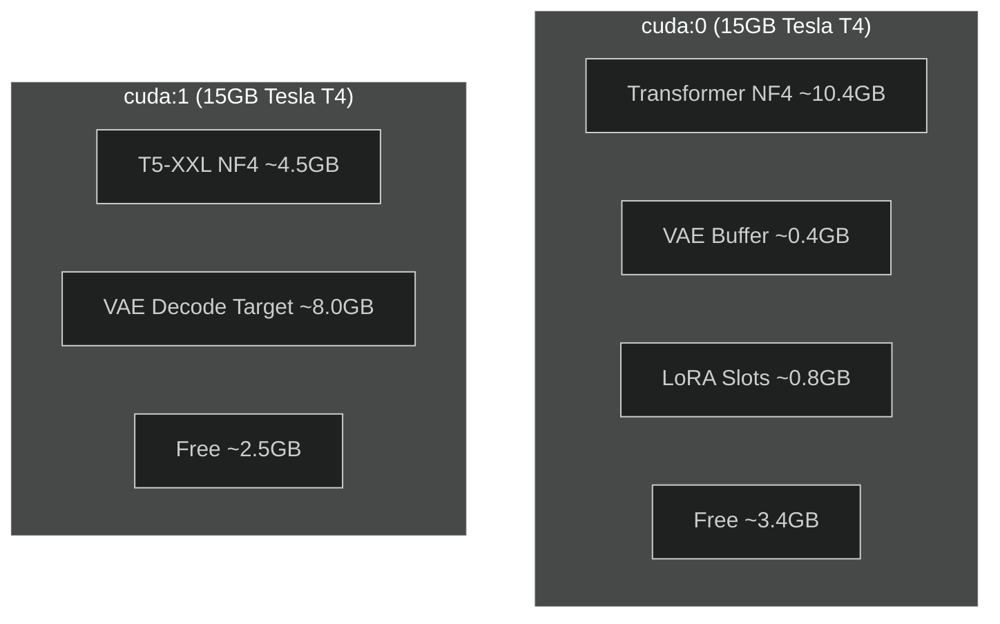
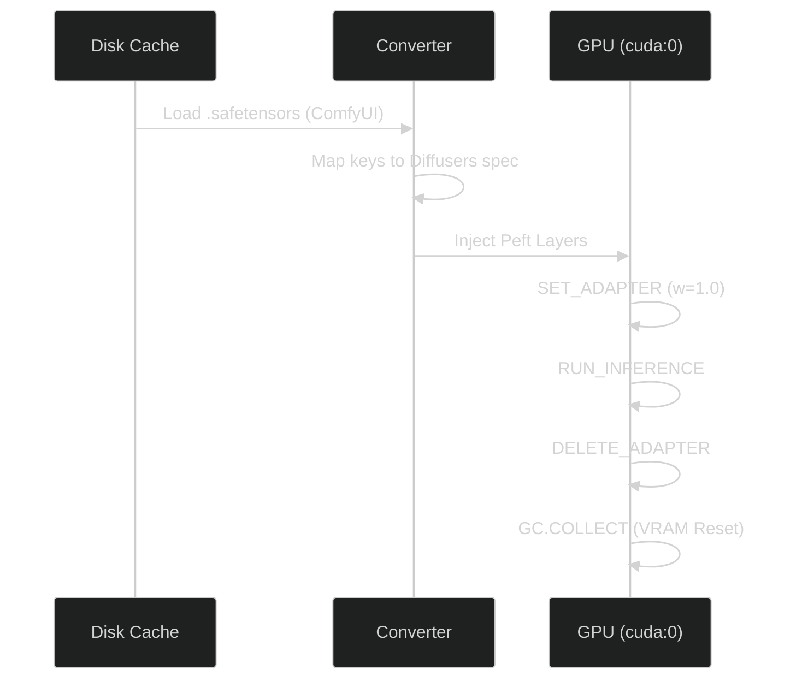

# LTX-Video 13B • Free Gen Pipeline

### 15s Native • 30s+ Chunked • 22 LoRAs • Dual Tesla T4

**The only free, open-source pipeline in the world capable of running 13-billion parameter video diffusion with 22 hot-swappable LoRAs and LLM-powered prompt enhancement on zero-cost hardware.**

[🚀 Open in Kaggle](https://www.kaggle.com/code/damnyadav/ltxv-13b-distilled-free-gpu-pipeline) • [📁 Model Cache](https://www.kaggle.com/datasets/damnyadav/ltxv13b-distilled-cache) • [⭐ Star repo](#)

---

## 📑 Table of Contents

- [✨ High-Fidelity Results](#-high-fidelity-results)
- [🔥 Capability Matrix](#-capability-matrix)
- [🏗️ Technical Architecture](#-technical-architecture)
- [🎭 LoRA registry](#-lora-registry)
- [🛠️ Setup Guide](#-setup-guide)
- [📖 Usage Guide](#-usage-guide)
- [⚠️ Constraints](#-constraints)
- [🔬 Technical Reference](#-technical-reference)

---

## ✨ High-Fidelity Results

<!-- Cache Refresh: 2026-04-07 13:00:10 -->

| Showcase A | Showcase B |
| :---: | :---: |
|  **Snorricam**: Character Walk |  **T2V**: City Timelapse |
|  **Flying**: Coastal Cliffs |  **Bullet Time**: Martial Arts |
|  **Arcane**: Jinx with Headphones |  **Character**: Jinx Portrait |
|  **Wallace & Gromit**: Kitchen |  **Wallace & Gromit**: Garden |
|  **Arcane**: Rooftop Scene |  **T2V**: Train Window |

---

## 🔥 Capability Matrix

| Feature | Production Baseline | LTXV-13B Free Pipeline |
| :--- | :--- | :--- |
| **Model Scaling** | 40GB VRAM (A100/H100) | **8GB NF4** (Tesla T4) |
| **Adapter System** | Static / Low-VRAM only | **22 Hot-swappable LoRAs** |
| **Max Duration** | ~6s @ 8fps (Free) | **15s Native / 30s+ Chunked** |
| **Prompt Engineering** | Manual / Brittle | **NVIDIA NIM Agent** (LLM-Enhanced) |
| **Infrastructure** | Large Cluster | **Dual Tesla T4** (Free) |

---

## 🏗️ Technical Architecture

### 1. Generation Lifecycle

### 2. Physical Memory Mapping

### 3. Progressive LoRA Lifecycle

---

## 🎭 LoRA Registry

<b>Click to expand full LoRA Registry (22 adapters)</b>

| ID | Name | Trigger | Category | Mode | Description |
| :--- | :--- | :--- | :--- | :--- | :--- |
| `bullet_time` | 🎬 Bullet Time | `bullet-time` | Camera | T2V/I2V | Matrix-style freeze + 360° orbital camera |
| `through_object` | 🎬 Through Object | `through-object` | Camera | T2V | Camera passes through solid surfaces seamlessly |
| `snorricam` | 🎬 Snorricam | `snorricam` | Camera | T2V/I2V | Body-mounted camera, subject perfectly centered |
| `equirect360` | 🎬 360° Equirect | `360-equirectangular` | Camera | T2V | Panoramic equirectangular landscape generation |
| `flying` | 🎬 Flying | `flying` | Camera | T2V | Smooth aerial/drone cinematic motion |
| `wallace_gromit` | 🎨 Wallace & Gromit | `walgro style` | Style | T2V/I2V | Aardman claymation stop-motion aesthetic |
| `arcane` | 🎨 Arcane Style | `csetiarcane` | Style | T2V/I2V | Painterly stylized animation with rim lighting |
| `shinkai_anime`| 🎨 Shinkai Anime | `sh1nka1 style` | Style | T2V/I2V | Makoto Shinkai aesthetic (Your Name/Suzume) |
| `fat_elvis` | 🕺 Fat Elvis | `FATELVIS` | Style | T2V/I2V | Elvis character transformation |
| `cakeify` | ✨ Cakeify | `CAKEIFY` | Effect | T2V/I2V | Transforms objects into realistic hyper-cakes |
| `melt` | ✨ Melt | `M3LTYX` | Effect | T2V/I2V | Objects melt like wax into pooling liquid |
| `face_punch` | ✨ Face Punch | `Face_punch` | Effect | I2V | Impact shockwave effect on portraits |
| `explosion` | ✨ Building Blast | `Building_explosion` | Effect | T2V | High-fidelity building destruction |
| `cargrip` | ✨ Car Grip | `CarGrip` | Effect | T2V | Drifting with tire smoke and tight handling |
| `amgery` | 😤 Amgery | `AMGERY` | Expression| I2V | Looney Tunes exaggerated anger |

---

## 🛠️ Setup Guide

### 1. Requirements

- **Kaggle Account**: [Sign up here](https://kaggle.com) (Phone verification required for GPU).
- **Hardware Selection**: Set Accelerator to **GPU T4 ×2**.
- **Model Access**: Agree to terms on [Lightricks LTX-Video 0.9.8](https://huggingface.co/Lightricks/LTX-Video-0.9.8-13B-distilled).

### 2. Environment Variables (Secrets)

Add these to your Kaggle Notebook via **Add-ons -> Secrets**:

| Key | Value | Purpose |
| :--- | :--- | :--- |
| `HF_TOKEN` | [HuggingFace User Access Token](https://huggingface.co/settings/tokens) | Repository Access |
| `NIM_API_KEY` | [NVIDIA NIM API Key](https://build.nvidia.com) | AI Prompt Enhancement |

### 3. Accelerating Launch

To skip the 10-minute download phase, use the pre-cached dataset:

1. Click **+ Add Data** in your notebook.
2. Search for: `ltxv13b-distilled-cache` by `damnyadav`.
3. The notebook will automatically prioritize this cache for ~2 minute startups.

---

## 📖 Usage Guide

> [!TIP]
> **Recommended Resolution**: Use **480p** when using LoRAs for the best VRAM stability. 720p works natively without LoRAs.

1. **Select LoRA**: Choose from the dropdown in the Gradio UI.
2. **Draft Prompt**: Describe your scene naturally (e.g., *"A cyberpunck city in rain"*).
3. **Enhance**: Click **Enhance Prompt**. The NVIDIA Llama-3.3-70B model will re-engineer your description into a cinematic masterpiece.
4. **Generate**: Click **Generate Video**. Process takes ~4-6 minutes for a 10s clip.

---

## 🔬 Technical Reference

<b>Detailed Framework Constants</b>

| Parameter | Value | Description |
| :--- | :--- | :--- |
| `MAX_TOKENS` | 128 | T5-XXL Tokenizer Ceiling |
| `STEPS` | 7 | Distilled non-uniform schedule |
| `CFG_SCALE` | 1.0 | Guidance-distilled requirement |
| `CHUNK_FFN` | 512 | Activation peak reduction (8x) |
| `TAIL_OVERLAP`| 33f | Autoregressive context frames |

---

## ⚠️ Constraints

- **Quantization**: NF4 compression may result in minor detail loss compared to 40GB FP16 mode.
- **T5 Limits**: The T5 encoder ignores everything beyond ~65 words. Keep prompts punchy.
- **VRAM Budget**: Each active LoRA consumes ~805MB. Running 2+ simultaneous LoRAs will likely trigger **OOM**.

---

**Built with pride by [DamnKuldeep](https://github.com/DamnKuldeep)**
Licensed under **Apache 2.0**

[Back to top ↑](#ltx-video-13b--free-gen-pipeline)

