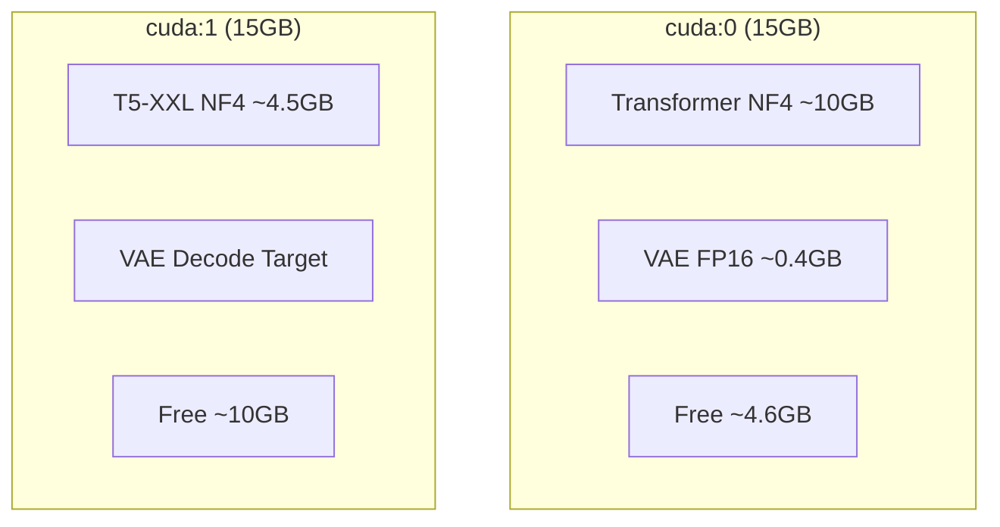
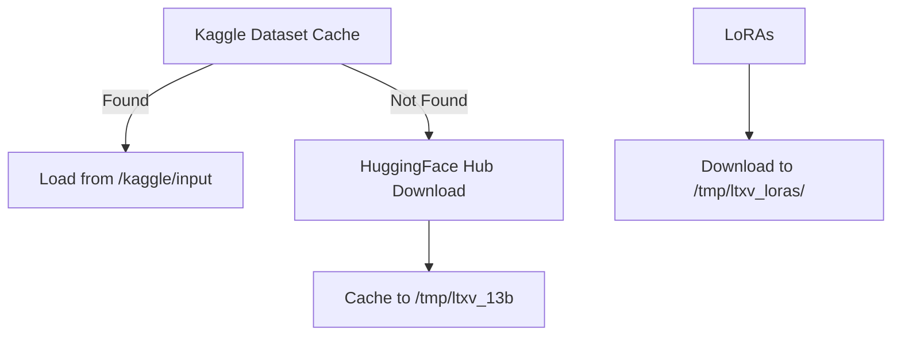
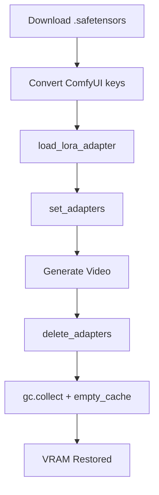
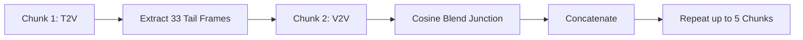

# LTX-Video 13B Free GPU Pipeline


-orange.svg)


The only free, open-source pipeline in the world that runs a 13-billion parameter video diffusion model with 22 LoRA adapters, LLM-powered prompt enhancement, image-to-video support, and a Gradio web UI — all on zero-cost Kaggle hardware. While paid alternatives require $2,000+ GPUs and the closest free alternative produces only 6 seconds of video at 8fps, this pipeline delivers professional-grade video generation for everyone.

**Star this repo ⭐ to support open-source video generation!**

## Table of contents
- [Results gallery](#results-gallery)
- [Features](#features)
- [Technical architecture](#technical-architecture)
- [LoRA registry](#lora-registry)
- [Setup guide](#setup-guide)
- [Usage guide](#usage-guide)
- [Limitations](#limitations)
- [Technical reference](#technical-reference)
- [Credits & license](#credits--license)

## Results gallery

<table>
<tr>
<td><video src="results/Character_Walk.mp4" autoplay loop muted playsinline width="100%"></video><br><sub>Snorricam: Character Walk</sub></td>
<td><video src="results/City_Timelapse.mp4" autoplay loop muted playsinline width="100%"></video><br><sub>T2V: City Timelapse</sub></td>
</tr>
<tr>
<td><video src="results/Coastal_Cliff.mp4" autoplay loop muted playsinline width="100%"></video><br><sub>Flying: Coastal Cliffs</sub></td>
<td><video src="results/Martial_Arts_Freeze.mp4" autoplay loop muted playsinline width="100%"></video><br><sub>Bullet Time: Martial Arts</sub></td>
</tr>
<tr>
<td><video src="results/Headphones_jinx.mp4" autoplay loop muted playsinline width="100%"></video><br><sub>Arcane Style: Jinx with Headphones</sub></td>
<td><video src="results/Jinx.mp4" autoplay loop muted playsinline width="100%"></video><br><sub>Character LoRA: Jinx Portrait</sub></td>
</tr>
<tr>
<td><video src="results/Kitchen_scene_walgro.mp4" autoplay loop muted playsinline width="100%"></video><br><sub>Wallace & Gromit: Kitchen Scene</sub></td>
<td><video src="results/Walgro_Garden.mp4" autoplay loop muted playsinline width="100%"></video><br><sub>Wallace & Gromit: Garden Scene</sub></td>
</tr>
<tr>
<td><video src="results/RooftopSky.mp4" autoplay loop muted playsinline width="100%"></video><br><sub>Arcane Style: Rooftop Scene</sub></td>
<td><video src="results/Train_window.mp4" autoplay loop muted playsinline width="100%"></video><br><sub>T2V: Train Window</sub></td>
</tr>
</table>

## Features

| Capability | Traditional Requirement | Our Solution |
|---|---|---|
| 13B model inference | 40GB VRAM (A100) | 8GB NF4 on T4 (15GB) |
| LoRA hot-swap | 24GB+ local GPU | Delete-before-load on 15GB |
| 15-second native video | H100 real-time | 5 min on T4 |
| 30s+ chunked video | Multi-GPU cluster | Autoregressive cosine blending |
| Prompt enhancement | Manual prompt engineering | LLM agent (NIM free tier, LoRA-aware) |
| I2V generation | ComfyUI + local setup | Gradio UI on Kaggle |
| Dual-GPU memory split | Custom CUDA code | diffusers device_map="auto" |
| 22 LoRA adapters | Download + convert manually | Auto-download + ComfyUI→diffusers conversion |

## Technical architecture

### 1. Full generation pipeline
```mermaid
graph LR
    A[User Prompt] --> B[LLM Enhancement (NIM)]
    B --> C[LoRA Load]
    C --> D[Distilled Denoising (7 steps)]
    D --> E[VAE Decode (cuda:1)]
    E --> F[Video Export]
```

### 2. Dual-GPU memory layout


### 3. Model download priority chain


### 4. LoRA lifecycle


### 5. Autoregressive chunked generation


## LoRA registry

<details>
<summary>Click to expand full LoRA registry (22 adapters)</summary>

| ID | Name | Trigger | Category | Best Mode | Best Duration | Source | Description |
|---|---|---|---|---|---|---|---|
| bullet_time | 🎬 Bullet Time | `bullet-time` | Camera | T2V/I2V | 5-8s | Lightricks/LTXV-LoRAs (@melmass) | Matrix-style freeze + 360° camera orbit around frozen moment |
| through_object | 🎬 Through Object | `through-object` | Camera | T2V | 5-8s | Lightricks/LTXV-LoRAs (@melmass) | Camera passes through solid surfaces seamlessly |
| snorricam | 🎬 Snorricam | `snorricam` | Camera | T2V/I2V | 5-10s | Lightricks/LTXV-LoRAs (@Nebsh) | Body-mounted camera, subject stays centered |
| equirect360 | 🎬 360° Equirect | `360-equirectangular` | Camera | T2V | 8-15s | Lightricks/LTXV-LoRAs (@burgstall) | 360° panoramic equirectangular video |
| flying | 🎬 Flying | `flying` | Camera | T2V | 8-15s | Lightricks/LTXV-LoRAs | Smooth aerial/drone camera movement |
| wallace_gromit | 🎨 Wallace & Gromit | `walgro style` | Style | T2V/I2V | 5-15s | Lightricks/LTXV-LoRAs (@Cseti) | Aardman claymation stop-motion aesthetic |
| arcane | 🎨 Arcane Style | `csetiarcane` | Style | T2V/I2V | 5-15s | Lightricks/LTXV-LoRAs (@Cseti) | Painterly Arcane TV animation with brushstrokes |
| shinkai_anime | 🎨 Shinkai Anime | `sh1nka1 style` | Style | T2V/I2V | 5-15s | Cseti/ltxv-13b-shinkai-anime-style-lora-v1 | Makoto Shinkai anime (Your Name). Add "animation" if effect weak |
| fat_elvis | 🕺 Fat Elvis | `FATELVIS` | Style | T2V/I2V | 5-10s | Lightricks/LTXV-LoRAs (@burgstall) | Elvis character transformation |
| arcane_jinx | 🎭 Arcane Jinx | `csetiarcane Nfj1nx blue hair` | Character | T2V | 5-10s | Cseti/LTXV-13B-LoRA-Arcane_Jinx-v1 | Jinx from Arcane. Overtrained: use strength 0.6-0.7 |
| cakeify | ✨ Cakeify | `CAKEIFY` | Effect | T2V/I2V | 3-8s | Lightricks/LTX-Video-Cakeify-LoRA | Transforms objects into realistic cake |
| melt | ✨ Melt | `M3LTYX` | Effect | T2V/I2V | 3-8s | Lightricks/LTXV-LoRAs (@burgstall) | Objects melt like wax |
| face_punch | ✨ Face Punch | `Face_punch` | Effect | I2V | 3-5s | Lightricks/LTXV-LoRAs (@Nebsh) | Face impact shockwave effect |
| explosion | ✨ Building Explosion | `Building_explosion` | Effect | T2V | 3-8s | Lightricks/LTXV-LoRAs (@Nebsh) | Dramatic building destruction |
| cargrip | ✨ Car Grip | `CarGrip` | Effect | T2V | 5-10s | Lightricks/LTXV-LoRAs | Car drifting with tire smoke |
| deflate | 🔄 Deflate | `DEFLATE` | Transform | T2V/I2V | 5-10s | Lightricks/LTXV-LoRAs (@oumoumad) | Objects deflate like losing air |
| unpaint | 🔄 Unpaint | `UNPAINT` | Transform | T2V/I2V | 5-10s | Lightricks/LTXV-LoRAs (@oumoumad) | Paint dissolves revealing sketch underneath |
| sprout | 🔄 Sprout | `SPROUT` | Transform | T2V/I2V | 5-10s | Lightricks/LTXV-LoRAs (@oumoumad) | Plants grow rapidly from surfaces |
| tear | 🔄 Tear | `TEAR` | Transform | T2V/I2V | 5-10s | Lightricks/LTXV-LoRAs (@oumoumad) | Objects rip apart like paper |
| amgery | 😤 Amgery | `AMGERY` | Expression | I2V | 3-5s | Lightricks/LTXV-LoRAs (@burgstall) | Looney Tunes exaggerated anger |
| sorpresa | 😲 Sorpresa | `SORPRESA` | Expression | I2V | 3-5s | Lightricks/LTXV-LoRAs (@burgstall) | Exaggerated surprise reaction |
| snek | 🐍 Snek | `SNEK` | Expression | I2V | 3-5s | Lightricks/LTXV-LoRAs (@burgstall) | Snake-like transformation |

</details>

## Setup guide

**Step 1: Kaggle Account**
- Create account at [kaggle.com](https://kaggle.com)
- Phone verification required for GPU access
- Settings → Accelerator → GPU T4×2
- Weekly quota: ~30 GPU hours

**Step 2: Kaggle Secrets**
Add these to Settings → Secrets in your notebook editor:

| Secret Name | Where to Get | Required? |
|---|---|---|
| `HF_TOKEN` | [huggingface.co/settings/tokens](https://huggingface.co/settings/tokens) (read) | **Yes** |
| `NIM_API_KEY` | [build.nvidia.com](https://build.nvidia.com) → Llama 3.3 70B | Optional (enhancer) |

**Step 3: HuggingFace Model Access**
- Visit: [Lightricks/LTX-Video-0.9.8-13B-distilled](https://huggingface.co/Lightricks/LTX-Video-0.9.8-13B-distilled)
- Click "Agree and access repository" (instant approval)

**Step 4: (Optional) Permanent Model Cache**
To avoid 10-minute downloads every session:
1. First run downloads to `/tmp/ltxv_13b` (~8GB)
2. Create New Dataset → Upload `/tmp/ltxv_13b` folder
3. Add dataset to notebook → Notebook auto-detects it
4. Alternatively, use public cache: [damnyadav/ltxv13b-distilled-cache](https://www.kaggle.com/datasets/damnyadav/ltxv13b-distilled-cache)

**Step 5: Run the Notebook**
- Upload [ltxv-13b-lora-pipeline.ipynb](ltxv-13b-lora-pipeline.ipynb) to Kaggle
- Enable GPU T4×2 and Internet
- Run All Cells (takes ~12 min first time)
- Open the resulting `share.gradio.live` URL

## Usage guide

**Workflow:**
1. Select a LoRA from the dropdown (or "None")
2. Review the info panel for usage tips and trigger words
3. Write your prompt or pick a template
4. Click **Enhance** — the LLM rewrites your prompt for cinematic quality
5. Click **Generate** — video appears in the output panel

**T2V Prompting (text-to-video):**
- Structure: Subject+Action → Camera+Lens → Lighting → Atmosphere
- Example: "A woman walks through a sunlit forest, camera tracking alongside, 50mm lens, natural motion blur"

**I2V Prompting (image-to-video):**
- Upload a photo, then describe ONLY what CHANGES
- Never describe what is already visible in the image
- Example: "The subject begins walking forward, camera slowly dollying in, hair swaying in breeze"

**Strength guide:**
- **0.5-0.7**: Subtle hint of the effect
- **0.8-1.0**: Clear, full effect (Default)
- **Arcane Jinx**: Use 0.6-0.7 (overtrained)

## Limitations

- **T5 128 token limit** — prompts beyond ~65 words are silently truncated.
- **NF4 quantization** — slight detail loss vs full FP16 inference.
- **No IC-LoRAs** — depth, pose, and detailer LoRAs require a V2V pipeline.
- **LoRA VRAM cost** — each LoRA is ~805MB, reducing max frame count at 480p from 15s to 9.7s.
- **Max 1 LoRA** — VRAM is too tight for multiple simultaneous adapters.
- **Motion Drift** — noticeable drift in autoregressive chunks beyond 30s.

## Technical reference

<details>
<summary>Click to expand technical reference</summary>

### Config constants

| Constant | Default | Purpose |
|---|---|---|
| MAX_PROMPT_TOKENS | 128 | T5 max_model_length |
| DISTILLED_TIMESTEPS | [1000,993,...] | Official 7-step schedule |
| FFN_CHUNK_SIZE | 512 | Tokens per FFN chunk (8× reduction) |
| COND_TAIL_FRAMES | 33 | Overlap frames for chunking |
| JUNCTION_BLEND | 16 | Cosine blend frames |

### VRAM budget (480p, no LoRA)

| Stage | cuda:0 (Transformer) | cuda:1 (T5/VAE) |
|---|---|---|
| After Model Load | 10.4 GB used | 5.0 GB used |
| Free for Gen | 4.6 GB | 10.0 GB |
| During Denoising | ~14 GB peak | ~5 GB |
| During VAE Decode | ~11 GB | ~8 GB peak |

### Frame caps (Tested)

| Resolution | T2V (no LoRA) | T2V (1 LoRA) | VideoExt | Duration |
|---|---|---|---|---|
| 480p (832×480) | 449 frames | ~290 frames | 297 frames | 15.0s / 9.7s |
| 720p (1280×720) | 193 frames | ⚠️ OOM risk | 161 frames | 6.4s |

</details>

## Credits & license

**Built with:**
- [Lightricks LTX-Video](https://github.com/Lightricks/LTX-Video) — Apache 2.0
- [HuggingFace Diffusers](https://github.com/huggingface/diffusers)
- [bitsandbytes](https://github.com/bitsandbytes-foundation/bitsandbytes)
- [NVIDIA NIM](https://build.nvidia.com)
- [Gradio](https://gradio.app)

**LoRA creation:** @melmass, @Nebsh, @Cseti, @burgstall, @oumoumad, Lightricks team

**Author:** [DamnKuldeep](https://github.com/DamnKuldeep) (yadavkuldeep3103@gmail.com)

**License:** Apache 2.0
